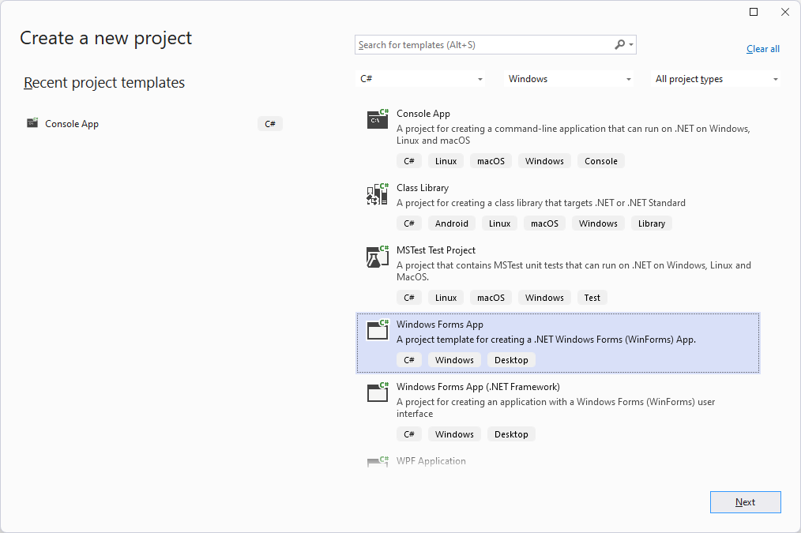
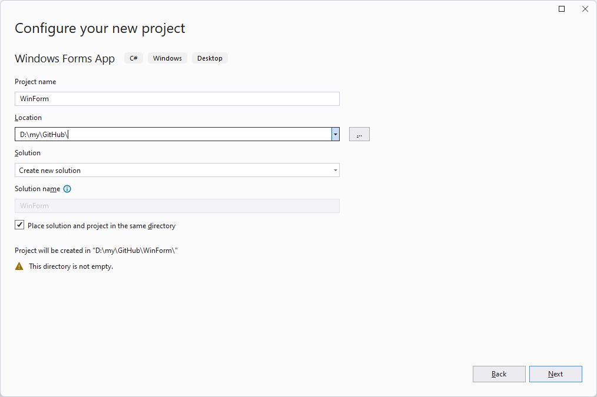
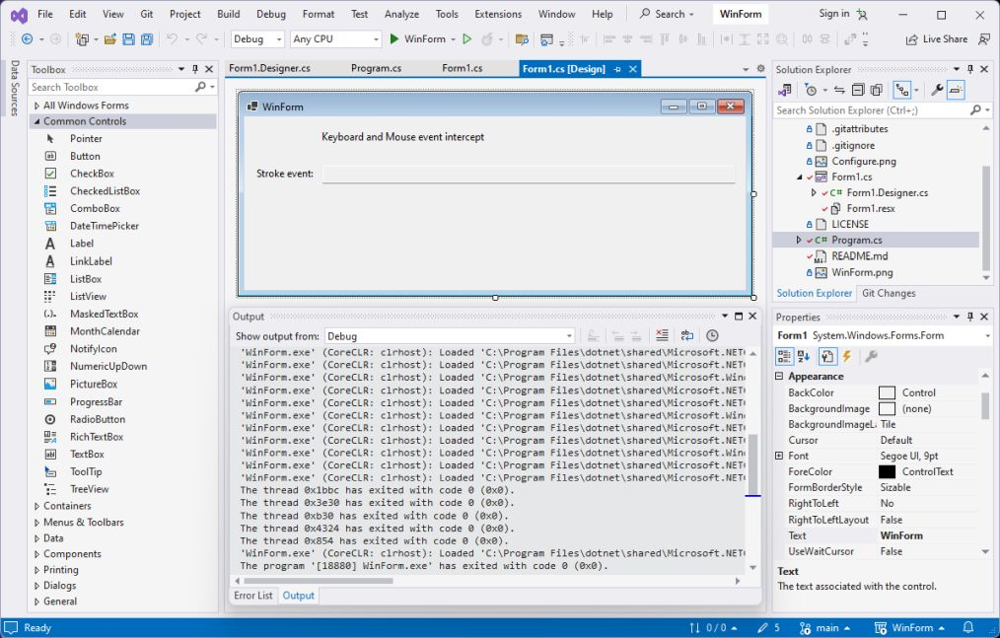
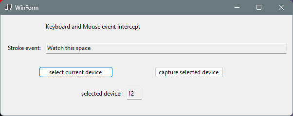

# WinForm - MessageBox branch  
 C# Winform app slightly less simple than `main` branch
- Downloaded [.gitignore](https://github.com/github/gitignore/blob/main/VisualStudio.gitignore) *before* GitHub Desktop commit of Visual Studio configuration  
  
  
- Form size can be changed by dragging tiny control boxes with mouse pointer  
  or by `Size` under **Layout** in `Properties` box (lower right)  
	- Form title can be edited in `Text` under **Appearance** in `Properties` box
- [`View > Toolbox` (pin)](https://learn.microsoft.com/en-us/visualstudio/ide/reference/toolbox?view=vs-2022) -
    [*descriptions*](https://learn.microsoft.com/en-us/dotnet/desktop/winforms/controls/controls-to-use-on-windows-forms)
    - Toolbox [Controls](https://learn.microsoft.com/en-us/dotnet/desktop/winforms/controls/controls-to-use-on-windows-forms)
 	can be dragged and dropped onto the form;  
	  corresponding `Properties` appear.
	- **Avoid double-clicking Controls**; Designer will assume that events are wanted...   
	- Change `TextBox` **Behavior** `ReadOnly` property to **True** for using it as a *display* window:  
	```
  		string foo = "watch this";
  		textBox1.Text = foo;
	```
  

### MessageBox branch
Added MessageBox in Form1.Designer.cs `Dispose()`;  
- MessageBox did not get invoked inside `if (disposing && (components != null)) {}`  
- `Dispose()` invokes MessageBox as WinForm.exe exits;  
   a good place to unintercept Mouse and Keyboard events.. 
- This happens inside Program.cs `Application.Run(form1);`  
- can setup callback to `form1.Write()` just before that.  
- **Intercept controls**  
	  
	- button to select device currently shown in **Stroke event** TextBox  
	- read-only TextBox to display selected device  
	- button to intercept strokes from selected device  
		(then [minimize to notification area](https://www.c-sharpcorner.com/UploadFile/f9f215/how-to-minimize-your-application-to-system-tray-in-C-Sharp/))  
		- Windows icons are 256 x256, then resized automatically where used.
		- [Example code](https://www.c-sharpcorner.com/UploadFile/f9f215/how-to-minimize-your-application-to-system-tray-in-C-Sharp/)
			 needed a `?` to resolve [nullable warning](https://learn.microsoft.com/en-us/dotnet/csharp/language-reference/compiler-messages/nullable-warnings):  
		```
		// https://www.c-sharpcorner.com/UploadFile/f9f215/how-to-minimize-your-application-to-system-tray-in-C-Sharp/
        public void Form1_Resize(object? sender, EventArgs e)   // question mark is crucial(?!)
        {
            // hide minimized form from the task bar; show NotifyIcon in notification area
            if (this.WindowState == FormWindowState.Minimized)
            {
                Hide();
                notifyIcon1.Visible = true;
            }
        }
		```
